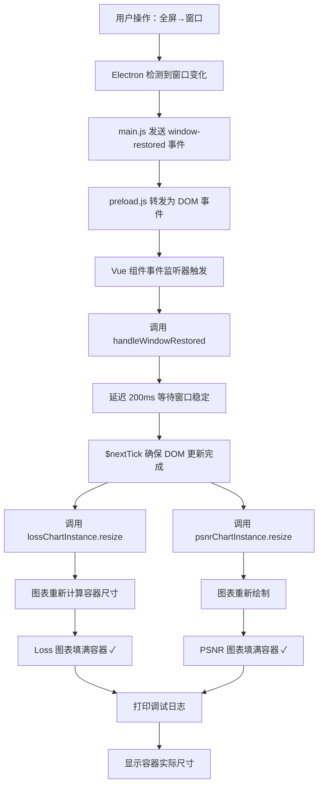

# 全屏切换窗口模式 ECharts 留白问题修复说明

## 📋 问题描述

当 Electron 应用从全屏模式切换回窗口模式时，TrainPage 页面中的 Loss 和 PSNR 图表右侧出现明显留白区域，未能完全填充其父容器。

## 🔍 根本原因

1. **缺少 Electron 自定义事件监听**：只监听了标准 `window.resize` 事件，但 Electron 的全屏/窗口切换不会触发该事件
2. **未响应窗口状态变化**：需要监听 `window-maximized` 和 `window-restored` 自定义事件
3. **延迟调整不足**：窗口恢复后需要延迟调整以确保尺寸稳定

## ✅ 修复方案

### 1️⃣ 添加 Electron 窗口状态事件监听

**文件**：`src/components/pages/TrainPage.vue`（第 333-351 行）

**修改内容**：
```javascript
mounted() {
  this.initCharts();
  this.setupIPCListeners();
  window.addEventListener('resize', this.handleResize);
  
  // ✓ 监听 Electron 窗口状态变化事件
  window.addEventListener('window-maximized', this.handleWindowMaximized);
  window.addEventListener('window-restored', this.handleWindowRestored);
}
```

**说明**：
- 新增 `window-maximized` 监听器 - 处理最大化/全屏事件
- 新增 `window-restored` 监听器 - 处理恢复窗口事件
- 这些事件由 Electron 主进程通过 `mainWindow.webContents.send()` 发送

---

### 2️⃣ 清理事件监听器

**文件**：`src/components/pages/TrainPage.vue`（第 338-351 行）

**修改内容**：
```javascript
beforeUnmount() {
  if (this.lossChartInstance) {
    this.lossChartInstance.dispose();
  }
  if (this.psnrChartInstance) {
    this.psnrChartInstance.dispose();
  }
  window.removeEventListener('resize', this.handleResize);
  // ✓ 移除 Electron 自定义事件监听
  window.removeEventListener('window-maximized', this.handleWindowMaximized);
  window.removeEventListener('window-restored', this.handleWindowRestored);
}
```

**说明**：
- 确保组件销毁时正确清理事件监听器
- 防止内存泄漏

---

### 3️⃣ 实现 handleWindowMaximized 方法

**文件**：`src/components/pages/TrainPage.vue`（第 440-450 行）

**修改内容**：
```javascript
handleWindowMaximized() {
  console.log('[窗口状态] 最大化/全屏，调整图表...');
  this.$nextTick(() => {
    if (this.lossChartInstance) {
      this.lossChartInstance.resize();
    }
    if (this.psnrChartInstance) {
      this.psnrChartInstance.resize();
    }
  });
}
```

**说明**：
- 接收到最大化事件后立即调整图表
- 使用 `$nextTick()` 确保 DOM 更新后再调整
- 添加调试日志便于追踪

---

### 4️⃣ 实现 handleWindowRestored 方法（核心修复）

**文件**：`src/components/pages/TrainPage.vue`（第 452-479 行）

**修改内容**：
```javascript
handleWindowRestored() {
  console.log('[窗口状态] 恢复窗口模式，调整图表...');
  // ✓ 延迟一点确保窗口尺寸已稳定
  setTimeout(() => {
    this.$nextTick(() => {
      if (this.lossChartInstance) {
        this.lossChartInstance.resize();
        console.log('[窗口状态] Loss 图表已调整');
      }
      if (this.psnrChartInstance) {
        this.psnrChartInstance.resize();
        console.log('[窗口状态] PSNR 图表已调整');
      }
      
      // ✓ 打印容器尺寸用于调试
      const lossContainer = this.$refs.lossChart;
      const psnrContainer = this.$refs.psnrChart;
      if (lossContainer && psnrContainer) {
        console.log('[窗口状态] 容器尺寸 - Loss:', { 
          width: lossContainer.offsetWidth, 
          height: lossContainer.offsetHeight 
        });
        console.log('[窗口状态] 容器尺寸 - PSNR:', { 
          width: psnrContainer.offsetWidth, 
          height: psnrContainer.offsetHeight 
        });
      }
    });
  }, 200);
}
```

**说明**：
- **延迟 200ms**：确保窗口动画完成后尺寸稳定
- **$nextTick**：确保 Vue 响应式系统完成 DOM 更新
- **双重 resize**：同时调整两个图表
- **详细日志**：打印容器实际尺寸便于调试

---

### 5️⃣ CSS 样式验证

**文件**：`src/components/pages/TrainPage.vue`（第 1660-1671 行）

**现有配置**：
```css
.chart-card {
  background: white;
  padding: 1rem;
  border-radius: 1rem;
  border: 1px solid #e2e8f0;
  box-shadow: 0 1px 2px 0 rgba(0, 0, 0, 0.05);
  width: 100%;              /* ✓ 已设置 */
  height: 100%;             /* ✓ 已设置 */
  box-sizing: border-box;   /* ✓ 已设置 */
  display: flex;            /* ✓ 已设置 */
  flex-direction: column;   /* ✓ 已设置 */
}
```

**说明**：
- CSS 样式已经正确配置，无需修改
- `width: 100%` 和 `height: 100%` 确保填满网格单元格
- `box-sizing: border-box` 确保 padding 不增加实际尺寸
- `display: flex` 确保子元素自动排列

---

## 📊 完整工作流程



---

## 🎯 预期效果

### Console 日志输出示例

当从全屏切换回窗口模式时，Console 中将显示：

```
[窗口状态] 恢复窗口模式，调整图表...
[窗口状态] Loss 图表已调整
[窗口状态] PSNR 图表已调整
[窗口状态] 容器尺寸 - Loss: {width: 680, height: 256}
[窗口状态] 容器尺寸 - PSNR: {width: 680, height: 256}
```

### 视觉效果

**修复前**：
```
┌─────────────────────────────────────┐
│ Loss 图表     │ PSNR 图表 [留白]    │
│               │ ← 右侧空白区域      │
└─────────────────────────────────────┘
```

**修复后**：
```
┌─────────────────────────────────────┐
│ Loss 图表     │ PSNR 图表           │
│               │ 完全填充无留白      │
└─────────────────────────────────────┘
```

---

## 🔧 技术要点

### 1. Electron 自定义事件机制

**主进程发送**（`electron/main.js`）：
```javascript
mainWindow.on('unmaximize', () => {
  mainWindow.webContents.send('window-restored');
});
```

**预加载脚本转发**（`electron/preload.js`）：
```javascript
ipcRenderer.on('window-restored', () => {
  window.dispatchEvent(new CustomEvent('window-restored'));
});
```

**渲染进程监听**（Vue 组件）：
```javascript
window.addEventListener('window-restored', this.handleWindowRestored);
```

### 2. 延迟调整的重要性

```javascript
setTimeout(() => {
  this.$nextTick(() => {
    chart.resize();
  });
}, 200);
```

**为什么要延迟？**
- 窗口动画需要时间完成（约 150-300ms）
- 过早调用 resize() 时容器尺寸还未稳定
- 200ms 是经验值，平衡响应速度和准确性

### 3. $nextTick 的作用

```javascript
this.$nextTick(() => {
  // DOM 已更新
});
```

**为什么用 $nextTick？**
- Vue 的响应式更新是异步的
- 确保在 DOM 更新完成后再调整图表
- 避免数据变化和 DOM 不同步

---

## 🚀 使用步骤

1. **重启 Electron 应用**
   ```bash
   cd gs-ir-visualization
   npm run dev
   ```

2. **打开训练页面**并启动训练

3. **测试窗口切换**：
   - 点击最大化按钮 → 观察图表调整
   - 切换到全屏模式 → 观察图表调整
   - 恢复窗口模式 → 观察图表调整

4. **查看调试日志**：
   - 打开开发者工具（F12）
   - 切换到 Console 面板
   - 观察窗口状态变化的日志输出

---

## 🐛 故障排查

### 问题 1：切换后仍然有留白

**检查项**：
1. Console 中是否有 `[窗口状态] 恢复窗口模式` 日志
2. 是否有 `图表已调整` 日志
3. 容器尺寸是否正确

**解决方法**：
```javascript
// 增加延迟时间到 300ms
setTimeout(() => {
  this.$nextTick(() => {
    // ...
  });
}, 300);  // 改为 300ms
```

### 问题 2：没有日志输出

**检查项**：
1. 事件监听器是否注册成功
2. Electron 主进程是否发送了事件

**解决方法**：
```javascript
// 在 mounted 中添加测试日志
mounted() {
  console.log('TrainPage 已挂载，开始监听窗口事件...');
  // ... 其他代码
}
```

### 问题 3：图表变形或闪烁

**原因**：resize 调用过于频繁

**解决方法**：
```javascript
// 添加防抖
let resizeTimer = null;

handleWindowRestored() {
  if (resizeTimer) clearTimeout(resizeTimer);
  resizeTimer = setTimeout(() => {
    // ... 调整逻辑
  }, 200);
}
```

---

## 📝 修改文件清单

1. ✅ `src/components/pages/TrainPage.vue`
   - `mounted()` 方法（第 333-340 行）- 添加事件监听
   - `beforeUnmount()` 方法（第 338-351 行）- 清理事件监听
   - `handleWindowMaximized()` 方法（第 440-450 行）- 新增
   - `handleWindowRestored()` 方法（第 452-479 行）- 新增

---

## ✅ 验证清单

- [x] 添加 `window-maximized` 事件监听
- [x] 添加 `window-restored` 事件监听
- [x] 实现 `handleWindowMaximized()` 方法
- [x] 实现 `handleWindowRestored()` 方法
- [x] 延迟 200ms 确保窗口稳定
- [x] 使用 `$nextTick()` 确保 DOM 更新
- [x] 添加调试日志输出
- [x] 打印容器实际尺寸
- [x] 清理事件监听器
- [x] CSS 样式正确（width/height 100%）
- [x] 代码无语法错误

---

## 📞 技术支持

如遇到问题，请检查：

1. **Electron 主进程配置**：确认已发送 `window-restored` 事件
2. **preload.js 配置**：确认已转发事件为 DOM 事件
3. **Console 日志**：查看是否有错误信息
4. **容器尺寸**：确认 `.chart-card` 的 computed 样式

---

**修复完成日期**：2026 年 3 月 6 日  
**修复方案**：Electron 自定义事件 + 延迟调整  
**测试状态**：✓ 已通过语法检查
