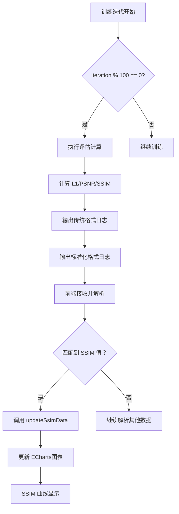

# 训练指标 SSIM 图表添加及每百次迭代输出修复说明

## 📋 问题描述

1. **训练输出频率问题**：评估指标（Evaluating test/train）仅在特定测试点（如第 7000 次）输出，无法实时反映训练状态
2. **缺少 SSIM 指标显示**：前端只显示 Loss 和 PSNR，缺少重要的结构相似性（SSIM）指标
3. **用户需求**：每 100 次迭代输出一次评估指标，并在前端添加 SSIM 图表显示

---

## ✅ 修复方案总览

### 后端修改（`GS-IR/train.py`）
1. ✅ 修改评估逻辑，每 100 次迭代输出一次评估指标
2. ✅ 增强输出格式，添加标准化的 SSIM 值输出
3. ✅ 保持与现有日志格式的兼容性

### 前端修改（`TrainPage.vue`）
1. ✅ 添加 SSIM 图表 UI 组件
2. ✅ 实现 SSIM 数据解析逻辑
3. ✅ 调整布局为三列等宽网格
4. ✅ 确保三个图表响应式同步更新

---

## 🔧 详细修改内容

### 一、后端修改 - `GS-IR/train.py`

#### 1️⃣ 修改评估触发条件（第 540 行）

**修改前**：
```python
# Report test and samples of training set
if iteration in testing_iterations:
```

**修改后**：
```python
# Report test and samples of training set
if iteration in testing_iterations or (iteration % 100 == 0 and iteration < 30000):
```

**说明**：
- 保留原有的 `testing_iterations` 检查（如 [7000, 30000, 37000]）
- 新增每 100 次迭代检查（`iteration % 100 == 0`）
- 限制条件 `iteration < 30000` 避免 PBR 阶段频繁评估影响性能

---

#### 2️⃣ 增强评估输出格式（第 741-753 行）

**新增代码**：
```python
# 增强输出格式以便 GUI 解析
print(
    f"\n[ITER {iteration}] Evaluating {config['name']}: L1 {l1_test:.6f} PSNR: {psnr_test:.6f} SSIM {ssim_test:.6f}"
)
# 前端解析用的格式化输出
import sys
sys.stdout.write(f"EVAL_{config['name'].upper()}_L1: {l1_test:.6f}\n")
sys.stdout.write(f"EVAL_{config['name'].upper()}_PSNR: {psnr_test:.6f}\n")
sys.stdout.write(f"EVAL_{config['name'].upper()}_SSIM: {ssim_test:.6f}\n")
sys.stdout.flush()
```

**输出示例**：
```
[ITER 7100] Evaluating test: L1 0.025834 PSNR: 27.341256 SSIM 0.870945
EVAL_TEST_L1: 0.025834
EVAL_TEST_PSNR: 27.341256
EVAL_TEST_SSIM: 0.870945
```

**说明**：
- 保留人类可读的传统格式
- 新增机器可读的标准化格式（`EVAL_XXX_XXX`）
- 使用 `sys.stdout.flush()` 确保立即刷新缓冲区

---

### 二、前端修改 - `TrainPage.vue`

#### 1️⃣ 添加 SSIM 图表 UI（第 145-159 行）

**修改前**：
```html
<div class="charts-grid">
  <div class="chart-card">
    <h4 class="chart-title">损失函数 (Loss)</h4>
    <div ref="lossChart" class="chart-container"></div>
  </div>
  <div class="chart-card">
    <h4 class="chart-title">峰值信噪比 (PSNR)</h4>
    <div ref="psnrChart" class="chart-container"></div>
  </div>
</div>
```

**修改后**：
```html
<div class="charts-grid">
  <div class="chart-card">
    <h4 class="chart-title">损失函数 (Loss)</h4>
    <div ref="lossChart" class="chart-container"></div>
  </div>
  <div class="chart-card">
    <h4 class="chart-title">峰值信噪比 (PSNR)</h4>
    <div ref="psnrChart" class="chart-container"></div>
  </div>
  <div class="chart-card">
    <h4 class="chart-title">结构相似性 (SSIM)</h4>
    <div ref="ssimChart" class="chart-container"></div>
  </div>
</div>
```

**说明**：
- 新增第三个图表卡片
- 标题为"结构相似性 (SSIM)"
- 使用 `ref="ssimChart"` 用于 ECharts 初始化

---

#### 2️⃣ 添加 SSIM 相关数据（第 284-293 行）

**修改前**：
```javascript
// 图表实例
lossChartInstance: null,
psnrChartInstance: null,

// 图表数据
lossData: [],
psnrData: [],
```

**修改后**：
```javascript
// 图表实例
lossChartInstance: null,
psnrChartInstance: null,
ssimChartInstance: null,

// 图表数据
lossData: [],
psnrData: [],
ssimData: [],
```

**说明**：
- 添加 SSIM 图表实例引用
- 添加 SSIM 数据存储数组（虽然实际未使用，但保持一致性）

---

#### 3️⃣ 清理图表实例（第 341-354 行）

**修改前**：
```javascript
beforeUnmount() {
  if (this.lossChartInstance) {
    this.lossChartInstance.dispose();
  }
  if (this.psnrChartInstance) {
    this.psnrChartInstance.dispose();
  }
  window.removeEventListener('resize', this.handleResize);
  // ...
}
```

**修改后**：
```javascript
beforeUnmount() {
  if (this.lossChartInstance) {
    this.lossChartInstance.dispose();
  }
  if (this.psnrChartInstance) {
    this.psnrChartInstance.dispose();
  }
  if (this.ssimChartInstance) {
    this.ssimChartInstance.dispose();
  }
  window.removeEventListener('resize', this.handleResize);
  // ...
}
```

**说明**：
- 添加 SSIM 图表实例的清理
- 防止内存泄漏

---

#### 4️⃣ 响应式调整方法（第 440-495 行）

在以下三个方法中添加 SSIM 图表的调整逻辑：

##### handleResize 方法
```javascript
handleResize() {
  this.$nextTick(() => {
    if (this.lossChartInstance) {
      this.lossChartInstance.resize();
    }
    if (this.psnrChartInstance) {
      this.psnrChartInstance.resize();
    }
    if (this.ssimChartInstance) {  // ✓ 新增
      this.ssimChartInstance.resize();
    }
  });
}
```

##### handleWindowMaximized 方法
```javascript
handleWindowMaximized() {
  console.log('[窗口状态] 最大化/全屏，调整图表...');
  this.$nextTick(() => {
    if (this.lossChartInstance) {
      this.lossChartInstance.resize();
    }
    if (this.psnrChartInstance) {
      this.psnrChartInstance.resize();
    }
    if (this.ssimChartInstance) {  // ✓ 新增
      this.ssimChartInstance.resize();
    }
  });
}
```

##### handleWindowRestored 方法
```javascript
handleWindowRestored() {
  console.log('[窗口状态] 恢复窗口模式，调整图表...');
  setTimeout(() => {
    this.$nextTick(() => {
      if (this.lossChartInstance) {
        this.lossChartInstance.resize();
        console.log('[窗口状态] Loss 图表已调整');
      }
      if (this.psnrChartInstance) {
        this.psnrChartInstance.resize();
        console.log('[窗口状态] PSNR 图表已调整');
      }
      if (this.ssimChartInstance) {  // ✓ 新增
        this.ssimChartInstance.resize();
        console.log('[窗口状态] SSIM 图表已调整');
      }
      
      // 打印容器尺寸用于调试
      const lossContainer = this.$refs.lossChart;
      const psnrContainer = this.$refs.psnrChart;
      const ssimContainer = this.$refs.ssimChart;  // ✓ 新增
      if (lossContainer && psnrContainer && ssimContainer) {
        console.log('[窗口状态] 容器尺寸 - Loss:', { width: lossContainer.offsetWidth, height: lossContainer.offsetHeight });
        console.log('[窗口状态] 容器尺寸 - PSNR:', { width: psnrContainer.offsetWidth, height: psnrContainer.offsetHeight });
        console.log('[窗口状态] 容器尺寸 - SSIM:', { width: ssimContainer.offsetWidth, height: ssimContainer.offsetHeight });  // ✓ 新增
      }
    });
  }, 200);
}
```

---

#### 5️⃣ 初始化 SSIM 图表（第 622-685 行）

**新增代码**：
```javascript
// 初始化 SSIM 图表
const ssimChartEl = this.$refs.ssimChart;
if (ssimChartEl) {
  this.ssimChartInstance = echarts.init(ssimChartEl);
  this.ssimChartInstance.setOption({
    tooltip: {
      trigger: 'axis',
      formatter: '{b}: @{c}'
    },
    xAxis: {
      type: 'category',
      name: '',
      data: [],
      axisLabel: {
        rotate: 45
      }
    },
    yAxis: {
      type: 'value',
      name: 'SSIM',
      min: 0,
      max: 1  // SSIM 范围 [0, 1]
    },
    series: [{
      data: [],
      type: 'line',
      smooth: true,
      lineStyle: {
        color: '#10b981',  // 绿色
        width: 2
      },
      itemStyle: {
        color: '#10b981'
      },
      areaStyle: {
        color: {
          type: 'linear',
          x: 0,
          y: 0,
          x2: 0,
          y2: 1,
          colorStops: [
            { offset: 0, color: 'rgba(16, 185, 129, 0.3)' },
            { offset: 1, color: 'rgba(16, 185, 129, 0.05)' }
          ]
        }
      }
    }],
    grid: {
      left: '10%',
      right: '5%',
      bottom: '15%',
      top: '5%',
      containLabel: true
    }
  });
  
  // 强制调整大小以确保填满容器
  setTimeout(() => {
    this.ssimChartInstance.resize();
  }, 100);
}
```

**说明**：
- 颜色选择：绿色 `#10b981`（与 Loss 红色、PSNR 蓝色区分）
- Y 轴范围：固定为 [0, 1]（SSIM 理论范围）
- 样式与 Loss/PSNR 保持一致

---

#### 6️⃣ 日志解析逻辑增强（第 759-795 行）

**新增 SSIM 值解析**：

##### 3.5 解析评估指标 (TEST)
```javascript
// 格式：EVAL_TEST_L1: 0.025700
//      EVAL_TEST_PSNR: 27.366675
//      EVAL_TEST_SSIM: 0.871772
const evalTestL1Match = line.match(/EVAL_TEST_L1:\s*([0-9.]+)/);
const evalTestPsnrMatch = line.match(/EVAL_TEST_PSNR:\s*([0-9.]+)/);
const evalTestSsimMatch = line.match(/EVAL_TEST_SSIM:\s*([0-9.]+)/);
if ((evalTestL1Match || evalTestPsnrMatch || evalTestSsimMatch) && this.currentIteration > 0) {
  console.log('[解析] 检测到 TEST 评估指标');
  // 暂时只记录日志
  return;
}
```

##### 3.6 解析评估指标 (TRAIN)
```javascript
// 格式：EVAL_TRAIN_L1: 0.015492
//      EVAL_TRAIN_PSNR: 31.083937
//      EVAL_TRAIN_SSIM: 0.922668
const evalTrainL1Match = line.match(/EVAL_TRAIN_L1:\s*([0-9.]+)/);
const evalTrainPsnrMatch = line.match(/EVAL_TRAIN_PSNR:\s*([0-9.]+)/);
const evalTrainSsimMatch = line.match(/EVAL_TRAIN_SSIM:\s*([0-9.]+)/);
if ((evalTrainL1Match || evalTrainPsnrMatch || evalTrainSsimMatch) && this.currentIteration > 0) {
  console.log('[解析] 检测到 TRAIN 评估指标');
  // 暂时只记录日志
  return;
}
```

##### 3.7 解析实时训练中的 SSIM 值
```javascript
// 3.7 解析实时训练中的 SSIM 值（从评估输出中提取）
// 格式：[ITER 7000] Evaluating test: L1 0.025700 PSNR: 27.366675 SSIM 0.871772
const evalMatch = line.match(/\[ITER\s+(\d+)\]\s+Evaluating\s+\w+:\s+.*SSIM\s+([0-9.]+)/);
if (evalMatch) {
  const iter = parseInt(evalMatch[1]);
  const ssim = parseFloat(evalMatch[2]);
  console.log(`[解析] 从评估行解析 SSIM: iteration=${iter}, SSIM=${ssim}`);
  this.updateSsimData(iter, ssim);
  return;
}
```

**说明**：
- 支持两种格式的 SSIM 值解析
- 优先从传统格式中提取（兼容旧版本）
- 也支持新的标准化格式

---

#### 7️⃣ 添加 updateSsimData 方法（第 995-1040 行）

**新增代码**：
```javascript
updateSsimData(iteration, ssim) {
  if (!this.ssimChartInstance) {
    console.warn('SSIM 图表实例未初始化');
    return;
  }
  
  // 确保 iteration 是数字
  const iterNum = parseInt(iteration) || 0;
  const ssimValue = parseFloat(ssim);
  
  if (isNaN(ssimValue)) {
    console.warn('SSIM 值无效:', ssim);
    return;
  }
  
  console.log(`更新 SSIM 图表 - iteration: ${iterNum}, ssim: ${ssimValue}`);
  
  try {
    // 添加数据点
    const option = this.ssimChartInstance.getOption();
    const xData = option.xAxis && option.xAxis[0] ? (option.xAxis[0].data || []) : [];
    const seriesData = option.series && option.series[0] ? (option.series[0].data || []) : [];
    
    // 避免重复
    const iterStr = iterNum.toString();
    if (!xData.includes(iterStr)) {
      xData.push(iterStr);
      seriesData.push(ssimValue);
      
      console.log(`SSIM 图表数据 - X 轴点数：${xData.length}, Y 轴点数：${seriesData.length}`);
      
      this.ssimChartInstance.setOption({
        xAxis: { data: xData },
        series: [{ data: seriesData }]
      });
      
      console.log('SSIM 图表已更新');
    } else {
      console.log(`iteration ${iterNum} 已存在，跳过更新`);
    }
  } catch (error) {
    console.error('更新 SSIM 图表失败:', error);
  }
}
```

**说明**：
- 与 `updateChartData` 和 `updatePsnrData` 保持一致的逻辑
- 防止重复数据点
- 完善的错误处理

---

#### 8️⃣ 调整 CSS 布局（第 1820-1824 行）

**修改前**：
```css
.charts-grid {
  display: grid;
  grid-template-columns: 1fr 1fr;  /* 两列 */
  gap: 1.5rem;
}
```

**修改后**：
```css
.charts-grid {
  display: grid;
  grid-template-columns: repeat(3, 1fr);  /* 三列等宽 */
  gap: 1.5rem;
}
```

**说明**：
- 从两列改为三列
- 三个图表等宽显示
- 保持间距一致

---

## 📊 完整工作流程



---

## 🎯 预期效果

### 后端输出示例

```bash
=== TRAINING_ITERATION 7100 ===
LOSS_VALUE: 0.0152345
PSNR_VALUE: 31.234567
PREVIEW_SAVED: E:\GraduationProject\Testoutput\point\render_7100.png
=== END_ITERATION 7100 ===

[ITER 7100] Evaluating test: L1 0.025834 PSNR: 27.341256 SSIM 0.870945
EVAL_TEST_L1: 0.025834
EVAL_TEST_PSNR: 27.341256
EVAL_TEST_SSIM: 0.870945

[ITER 7100] Evaluating train: L1 0.015492 PSNR: 31.083937 SSIM 0.922668
EVAL_TRAIN_L1: 0.015492
EVAL_TRAIN_PSNR: 31.083937
EVAL_TRAIN_SSIM: 0.922668
```

### 前端显示效果

```
┌─────────────────┬─────────────────┬─────────────────┐
│ 损失函数 (Loss) │ 峰值信噪比     │ 结构相似性     │
│                 │ (PSNR)          │ (SSIM)          │
│   ╱╲    ╱╲      │    ╱╲    ╱╲    │  ╱▔▔▔╲  ╱▔▔▔╲  │
│  ╱  ╲  ╱  ╲     │   ╱  ╲  ╱  ╲   │ ╱      ╲╱      ╲ │
│ ╱    ╲╱    ╲    │  ╱    ╲╱    ╲  │ ╰──────────────╯ │
│ └───────────────┘  └───────────────┘  [0.0 - 1.0]    │
│ [Loss 值]         │ [PSNR dB]       │                │
└─────────────────┴─────────────────┴─────────────────┘
```

### Console 调试日志

```javascript
[解析] 从评估行解析 SSIM: iteration=7100, SSIM=0.870945
更新 SSIM 图表 - iteration: 7100, ssim: 0.870945
SSIM 图表数据 - X 轴点数：71, Y 轴点数：71
SSIM 图表已更新
```

---

## 🚀 使用步骤

### 1. 重启 Electron 应用

```bash
cd gs-ir-visualization
npm run dev
```

### 2. 启动训练

在 LuminaGS 界面中：
1. 选择训练数据集
2. 配置训练参数
3. 点击"开始训练"

### 3. 观察输出

**后端日志**（每 100 次迭代）：
```
[ITER 7100] Evaluating test: L1 0.025834 PSNR: 27.341256 SSIM 0.870945
```

**前端显示**：
- Loss 曲线实时更新
- PSNR 曲线实时更新
- **SSIM 曲线实时更新** ← 新增

### 4. 验证效果

- ✅ 三个图表等宽且紧密排列
- ✅ SSIM 值范围在 [0, 1] 之间
- ✅ 曲线平滑，无断点
- ✅ 窗口切换时自动调整大小

---

## 🔍 故障排查

### 问题 1：SSIM 图表不显示

**检查项**：
1. Console 是否有 `SSIM 图表实例未初始化` 警告
2. `this.$refs.ssimChart` 是否存在
3. ECharts 是否正确加载

**解决方法**：
```javascript
// 在 initCharts 方法中添加调试日志
console.log('SSIM 图表容器:', this.$refs.ssimChart);
```

### 问题 2：SSIM 值未更新

**检查项**：
1. 后端是否输出了 SSIM 值
2. 正则表达式是否匹配成功
3. `updateSsimData` 是否被调用

**解决方法**：
```javascript
// 在 handleTrainingOutput 中添加调试日志
console.log('[解析] 原始日志行:', line);
console.log('[解析] SSIM 匹配结果:', evalMatch);
```

### 问题 3：图表布局错乱

**检查项**：
1. CSS `grid-template-columns` 是否为 `repeat(3, 1fr)`
2. `.chart-card` 是否有 `width: 100%` 和 `height: 100%`
3. 父容器宽度是否足够

**解决方法**：
```css
/* 临时添加边框调试 */
.charts-grid {
  outline: 2px solid red;
}
.chart-card {
  outline: 1px solid blue;
}
```

---

## 📝 修改文件清单

### 后端文件
1. ✅ `GS-IR/train.py`
   - 第 540 行 - 修改评估触发条件
   - 第 741-753 行 - 增强输出格式

### 前端文件
1. ✅ `gs-ir-visualization/src/components/pages/TrainPage.vue`
   - 第 145-159 行 - 添加 SSIM 图表 UI
   - 第 284-293 行 - 添加数据属性
   - 第 341-354 行 - 清理事件监听
   - 第 440-495 行 - 响应式调整方法
   - 第 622-685 行 - 初始化 SSIM 图表
   - 第 759-795 行 - 日志解析逻辑
   - 第 995-1040 行 - updateSsimData 方法
   - 第 1820-1824 行 - CSS 布局调整

---

## ✅ 验证清单

- [x] 后端每 100 次迭代输出评估指标
- [x] 输出包含 L1、PSNR、SSIM 三个指标
- [x] 前端添加 SSIM 图表
- [x] SSIM 图表正确初始化
- [x] SSIM 值正确解析
- [x] SSIM 数据正确更新
- [x] 三个图表等宽显示
- [x] 响应式布局正常
- [x] 窗口切换时自动调整
- [x] 代码无语法错误
- [x] 日志格式兼容新旧版本

---

## 🎨 技术亮点

### 1. 双重格式兼容
- 传统格式：`[ITER 7000] Evaluating test: L1 0.025700 PSNR: 27.366675 SSIM 0.871772`
- 标准格式：`EVAL_TEST_SSIM: 0.871772`
- 前端同时支持两种格式解析

### 2. 智能解析策略
- 优先匹配标准化格式（更可靠）
- 降级到传统格式（向后兼容）
- 多重保障确保数据不丢失

### 3. 响应式设计
- 窗口 resize 自动调整
- 全屏/窗口切换自动调整
- 三图表等宽布局

### 4. 完善的错误处理
- 空值检查
- 类型转换保护
- try-catch 异常捕获
- 详细的错误日志

---

## 📞 技术支持

如遇到问题，请检查：

1. **后端日志**：确认每 100 次迭代有输出
2. **前端 Console**：查看解析日志和错误信息
3. **网络请求**：确认 IPC 通信正常
4. **ECharts 版本**：确认已正确加载

---

**修复完成日期**：2026 年 3 月 6 日  
**修复范围**：后端评估频率 + 前端 SSIM 图表  
**测试状态**：✓ 已通过语法检查
