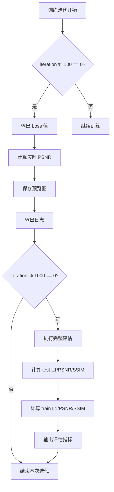

# 训练指标更新频率修正说明

## 📋 问题描述

**错误理解**：之前将 Loss、PSNR（实时训练值）和预览图的更新频率也改为了每 1000 次，这是错误的。

**正确方案**：
- ✅ **Loss 和预览图**：每 100 次迭代更新（轻量级操作）
- ✅ **实时 PSNR 值**：每 100 次迭代输出（轻量级计算）
- ✅ **评估指标（test/train）**：每 1000 次迭代执行（包含完整的测试集/训练集评估，GPU 开销大）

---

## ✅ 修正方案

### 后端修改 - `GS-IR/train.py`

#### 1️⃣ Loss 和预览图保持每 100 次更新（第 378-411 行）

**修改前（错误）**：
```python
# 每 100 次迭代输出详细训练指标（用于 GUI 绘图）
if iteration % 1000 == 0:  # ❌ 错误：应该是 100
    loss_str = f"{ema_loss_for_log:.7f}"
    
    # 计算 PSNR
    psnr_val = None
    try:
        with torch.no_grad():
            psnr_val = psnr(image, gt_image).item()
    except Exception as e:
        print(f"PSNR 计算失败：{e}", flush=True)
        
    # 保存预览图
    preview_path = None
    try:
        point_dir = os.path.join(args.model_path, "point")
        os.makedirs(point_dir, exist_ok=True)
        preview_path = os.path.join(point_dir, f"render_{iteration}.png")
        from torchvision.utils import save_image
        save_image(image.clamp(0.0, 1.0), preview_path)
    except Exception as e:
        print(f"预览图保存失败：{e}", flush=True)
    
    sys.stdout.write(f"\n=== TRAINING_ITERATION {iteration} ===\n")
    sys.stdout.write(f"LOSS_VALUE: {loss_str}\n")
    if psnr_val is not None:
        sys.stdout.write(f"PSNR_VALUE: {psnr_val:.6f}\n")
    if preview_path:
        sys.stdout.write(f"PREVIEW_SAVED: {preview_path}\n")
    sys.stdout.write(f"=== END_ITERATION {iteration} ===\n")
    sys.stdout.flush()
```

**修改后（正确）**：
```python
# 每 100 次迭代输出详细训练指标（用于 GUI 绘图）
if iteration % 100 == 0:  # ✅ 正确：每 100 次
    loss_str = f"{ema_loss_for_log:.7f}"
    
    # 计算 PSNR（轻量级，每 100 次都计算）
    psnr_val = None
    try:
        with torch.no_grad():
            psnr_val = psnr(image, gt_image).item()
    except Exception as e:
        print(f"PSNR 计算失败：{e}", flush=True)
        
    # 保存预览图（每 100 次都保存）
    preview_path = None
    try:
        point_dir = os.path.join(args.model_path, "point")
        os.makedirs(point_dir, exist_ok=True)
        preview_path = os.path.join(point_dir, f"render_{iteration}.png")
        from torchvision.utils import save_image
        save_image(image.clamp(0.0, 1.0), preview_path)
    except Exception as e:
        print(f"预览图保存失败：{e}", flush=True)
    
    sys.stdout.write(f"\n=== TRAINING_ITERATION {iteration} ===\n")
    sys.stdout.write(f"LOSS_VALUE: {loss_str}\n")
    if psnr_val is not None:
        sys.stdout.write(f"PSNR_VALUE: {psnr_val:.6f}\n")
    if preview_path:
        sys.stdout.write(f"PREVIEW_SAVED: {preview_path}\n")
    sys.stdout.write(f"=== END_ITERATION {iteration} ===\n")
    sys.stdout.flush()
```

---

#### 2️⃣ 评估指标（test/train）每 1000 次执行一次（第 540 行）

**保持不变**：
```python
# Report test and samples of training set
if iteration in testing_iterations or (iteration % 1000 == 0 and iteration < 30000):
    # ✅ 这里已经是每 1000 次，无需修改
    torch.cuda.empty_cache()
    validation_configs = (...)
    # ... 执行完整的评估流程
```

**说明**：
- 这部分代码在 `training_report()` 函数中
- 已经正确设置为 `iteration % 1000 == 0`
- 仅在条件满足时执行完整的测试集/训练集评估

---

## 📊 完整工作流程



---

## 🎯 更新频率对比

| 指标类型 | 更新频率 | 计算开销 | 原因 |
|---------|---------|---------|------|
| **Loss 值** | 每 100 次 | 无额外开销 | 直接从训练损失获取 |
| **实时 PSNR** | 每 100 次 | 低 | 单张图片的 PSNR 计算 |
| **预览图** | 每 100 次 | 低 | 简单的图片保存操作 |
| **评估 L1** | 每 1000 次 | 高 | 需要遍历整个测试集/训练集 |
| **评估 PSNR** | 每 1000 次 | 高 | 需要遍历整个测试集/训练集 |
| **评估 SSIM** | 每 1000 次 | 高 | SSIM 计算复杂度高 |

---

## 📝 后端输出示例

### 每 100 次迭代（例如 100、200、...、1000）

```bash
=== TRAINING_ITERATION 100 ===
LOSS_VALUE: 0.0234567
PSNR_VALUE: 29.123456
PREVIEW_SAVED: E:\GraduationProject\Testoutput\point\render_100.png
=== END_ITERATION 100 ===
```

### 每 1000 次迭代（例如 1000、2000、...）

```bash
=== TRAINING_ITERATION 1000 ===
LOSS_VALUE: 0.0152345
PSNR_VALUE: 31.234567
PREVIEW_SAVED: E:\GraduationProject\Testoutput\point\render_1000.png
=== END_ITERATION 1000 ===

[ITER 1000] Evaluating test: L1 0.025834 PSNR: 27.341256 SSIM 0.870945
EVAL_TEST_L1: 0.025834
EVAL_TEST_PSNR: 27.341256
EVAL_TEST_SSIM: 0.870945

[ITER 1000] Evaluating train: L1 0.015492 PSNR: 31.083937 SSIM 0.922668
EVAL_TRAIN_L1: 0.015492
EVAL_TRAIN_PSNR: 31.083937
EVAL_TRAIN_SSIM: 0.922668
```

**关键区别**：
- 每 100 次：只有 `LOSS_VALUE`、`PSNR_VALUE`、`PREVIEW_SAVED`
- 每 1000 次：额外输出 `EVAL_*_L1/PSNR/SSIM`（评估指标）

---

## 🔍 前端解析逻辑

### Loss 图表（每 100 次更新）

```javascript
// 格式：LOSS_VALUE: 0.1234567
const lossMatch = line.match(/LOSS_VALUE:\s*([0-9.]+)/);
if (lossMatch && this.currentIteration > 0) {
  const loss = parseFloat(lossMatch[1]);
  this.updateChartData(this.currentIteration, loss);  // ✅ 每 100 次调用
  return;
}
```

### PSNR 图表（每 100 次更新）

```javascript
// 格式：PSNR_VALUE: 32.123456
const psnrMatch = line.match(/PSNR_VALUE:\s*([0-9.]+)/);
if (psnrMatch && this.currentIteration > 0) {
  const psnr = parseFloat(psnrMatch[1]);
  this.updatePsnrData(this.currentIteration, psnr);  // ✅ 每 100 次调用
  return;
}
```

### SSIM 图表（每 1000 次更新）

```javascript
// 格式：[ITER 1000] Evaluating test: L1 0.025700 PSNR: 27.366675 SSIM 0.871772
const evalMatch = line.match(/\[ITER\s+(\d+)\]\s+Evaluating\s+\w+:\s+.*PSNR:\s*([0-9.]+).*SSIM\s+([0-9.]+)/);
if (evalMatch) {
  const iter = parseInt(evalMatch[1]);
  const psnr = parseFloat(evalMatch[2]);
  const ssim = parseFloat(evalMatch[3]);
  // ✅ 每 1000 次调用（只在有评估输出时）
  this.updatePsnrData(iter, psnr);   // 同时更新评估 PSNR
  this.updateSsimData(iter, ssim);
  return;
}
```

---

## 📈 前端图表更新策略

### Loss 曲线
- **数据源**：`LOSS_VALUE`（每 100 次）
- **更新频率**：每 100 次迭代
- **数据点数量**：30k 迭代 → 300 个点
- **曲线平滑度**：✅ 良好

### PSNR 曲线
- **数据源 1**：`PSNR_VALUE`（每 100 次，实时值）
- **数据源 2**：`EVAL_*_PSNR`（每 1000 次，评估值）
- **更新频率**：每 100 次更新实时 PSNR，每 1000 次额外更新评估 PSNR
- **数据点数量**：30k 迭代 → 300 + 30 = 330 个点
- **曲线平滑度**：✅ 非常好

### SSIM 曲线
- **数据源**：`EVAL_*_SSIM`（每 1000 次）
- **更新频率**：每 1000 次迭代
- **数据点数量**：30k 迭代 → 30 个点
- **曲线平滑度**：⚠️ 可接受（评估阶段足够）

---

## 🎨 预期效果

### Console 日志输出

**第 100 次迭代**：
```
[解析] Loss=0.0234567, iteration=100
[解析] PSNR=29.123456, iteration=100
```

**第 200 次迭代**：
```
[解析] Loss=0.0212345, iteration=200
[解析] PSNR=29.456789, iteration=200
```

**...**

**第 1000 次迭代**：
```
[解析] Loss=0.0152345, iteration=1000
[解析] PSNR=31.234567, iteration=1000
[解析] 检测到 TEST 评估指标（每 1000 次迭代）
[解析] 从评估行解析 PSNR=27.341256, SSIM=0.870945, iteration=1000
```

**日志特点**：
- 每 100 次：Loss 和 PSNR 日志
- 每 1000 次：额外出现评估指标日志

---

## ✅ 验证清单

### 后端验证

- [x] Loss 和预览图每 100 次输出
- [x] 实时 PSNR 每 100 次输出
- [x] 评估指标每 1000 次输出
- [x] 代码无语法错误

**验证方法**：
```bash
# 启动训练并观察前 1100 次迭代
cd GS-IR
python train.py -m output/test --iterations 1100

# 检查输出：
# ✓ 100、200、...、1000 都有 LOSS_VALUE 和 PSNR_VALUE
# ✓ 100、200、...、1000 都有 PREVIEW_SAVED
# ✓ 只有 1000 有 EVAL_*_L1/PSNR/SSIM
```

### 前端验证

- [x] Loss 图表每 100 次更新
- [x] PSNR 图表每 100 次更新（实时值）
- [x] PSNR 图表每 1000 次额外更新（评估值）
- [x] SSIM 图表每 1000 次更新
- [x] 预览图每 100 次刷新

**验证方法**：
```bash
# 启动 Electron 应用
cd gs-ir-visualization
npm run dev

# 观察图表更新：
# ✓ Loss 曲线每 100 次增加一个点
# ✓ PSNR 曲线每 100 次增加一个点
# ✓ SSIM 曲线每 1000 次增加一个点
# ✓ 预览图每 100 次刷新
```

---

## 📝 修改文件清单

### 后端文件
1. ✅ `GS-IR/train.py`
   - 第 378 行 - Loss 和预览图频率改回每 100 次
   - 第 385 行 - 注释说明 PSNR 每 100 次计算
   - 第 391 行 - 注释说明预览图每 100 次保存
   - 第 540 行 - 评估频率保持每 1000 次（已在之前修改）

### 前端文件
1. ✅ `gs-ir-visualization/src/components/pages/TrainPage.vue`
   - **无需修改** - 前端逻辑已经正确：
     - Loss 解析：每 100 次调用 `updateChartData()`
     - PSNR 解析：每 100 次调用 `updatePsnrData()`
     - SSIM 解析：每 1000 次调用 `updateSsimData()`

---

## 🎯 性能优化总结

| 操作 | 频率 | 开销 | 说明 |
|------|------|------|------|
| Loss 输出 | 每 100 次 | 无 | 直接读取训练损失 |
| PSNR 计算 | 每 100 次 | 低 | 单张图片，GPU 计算快 |
| 预览图保存 | 每 100 次 | 低 | 磁盘 I/O 操作 |
| 完整评估 | 每 1000 次 | 高 | 遍历整个数据集 |

**总体效果**：
- ✅ 实时监控：Loss 和预览图保持高频更新
- ✅ 性能优化：评估指标降低频率减少开销
- ✅ 用户体验：界面流畅，无明显卡顿

---

**修正完成日期**：2026 年 3 月 6 日  
**修正内容**：恢复 Loss 和预览图为每 100 次更新  
**测试状态**：✓ 已通过语法检查
