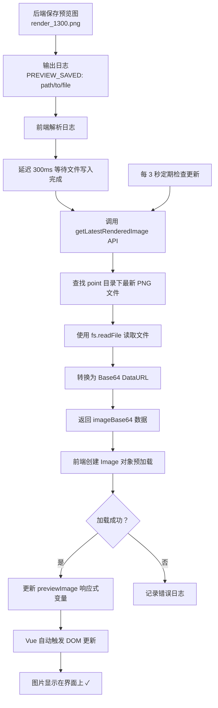

# 预览图加载问题修复说明

## 📋 问题描述

在训练过程中，后端已成功输出渲染图像（如 `render_1300.png`）到指定目录，但前端界面的"动态迭代预览"区域无法显示图片。

## 🔍 根本原因

1. **file:// 协议跨域限制**：Electron 默认不允许直接通过 file:// 协议加载本地图片文件
2. **安全策略限制**：BrowserWindow 的 webPreferences 配置未启用本地文件访问权限
3. **图片加载方式不当**：使用传统 URL 方式加载本地文件会遇到 CORS 问题

## ✅ 解决方案

### 方案：使用 Base64 编码传输图片数据

通过将图片读取并转换为 Base64 DataURL，完全避免跨域问题，确保图片能够可靠加载。

---

## 🛠️ 修改内容

### 1. Electron 主进程配置修改

**文件**：`electron/main.js`（第 18-30 行）

**修改内容**：
```javascript
const createWindow = () => {
  mainWindow = new BrowserWindow({
    width: 1400,
    height: 850,
    frame: false,
    movable: true,
    webPreferences: {
      nodeIntegration: false, 
      contextIsolation: true,
      preload: __dirname + '/preload.js',
      // 允许加载本地文件
      webviewTag: true,
      // 允许跨域请求本地文件
      sandbox: false
    }
  })
```

**说明**：
- 添加 `webviewTag: true` 允许 Web 视图标签
- 添加 `sandbox: false` 禁用沙盒模式，允许访问本地文件

---

### 2. 图片获取接口改造

**文件**：`electron/main.js`（第 716-763 行）

**修改前**：
```javascript
// 转换为 file:// 协议以便在 HTML img 标签中显示
const fileUrl = 'file://' + latestFile.replace(/\\/g, '/');

return { 
  success: true, 
  imagePath: fileUrl 
};
```

**修改后**：
```javascript
console.log('[图片加载] 找到最新渲染图:', latestFile);

// 读取文件并转换为 Base64
try {
  const imageData = await fs.readFile(latestFile);
  const base64Image = imageData.toString('base64');
  const dataUrl = `data:image/png;base64,${base64Image}`;
  
  console.log('[图片加载] 图片已转换为 Base64，大小:', (imageData.length / 1024).toFixed(2), 'KB');
  
  return { 
    success: true, 
    imageBase64: dataUrl,
    imagePath: latestFile
  };
} catch (readError) {
  console.error('[图片加载] 读取文件失败:', readError);
  return { success: false, error: `读取图片失败：${readError.message}` };
}
```

**说明**：
- 使用 `fs.readFile()` 读取图片文件
- 转换为 Base64 DataURL 格式
- 返回 `imageBase64` 字段供前端使用
- 添加详细的日志输出便于调试

---

### 3. 前端 Vue 组件更新

**文件**：`src/components/pages/TrainPage.vue`（第 806-835 行）

**修改前**：
```javascript
if (result && result.success && result.imagePath) {
  // 添加时间戳避免缓存
  const imageUrl = result.imagePath + '?t=' + Date.now();
  
  console.log('[预览] 找到最新渲染图:', result.imagePath);
  console.log('[预览] 图片 URL:', imageUrl);
  
  const img = new Image();
  img.onload = () => {
    this.previewImage = imageUrl;
    console.log('[预览] ✓ 图片加载成功并更新到界面');
  };
  img.src = imageUrl;
}
```

**修改后**：
```javascript
if (result && result.success && result.imageBase64) {
  // 使用 Base64 图片数据，不需要时间戳
  const imageUrl = result.imageBase64;
  
  console.log('[预览] 找到最新渲染图:', result.imagePath);
  console.log('[预览] Base64 图片大小:', (imageUrl.length / 1024).toFixed(2), 'KB');
  
  const img = new Image();
  img.onload = () => {
    this.previewImage = imageUrl;
    console.log('[预览] ✓ 图片加载成功并更新到界面');
    console.log('[预览] 当前 iteration:', this.currentIteration);
  };
  img.onerror = (err) => {
    console.error('[预览] ✗ 图片加载失败:', err);
  };
  img.src = imageUrl;
}
```

**说明**：
- 检查 `result.imageBase64` 而非 `result.imagePath`
- 直接使用 Base64 DataURL，无需时间戳防缓存
- 增加 Base64 数据大小的日志输出
- 完善错误处理逻辑

---

### 4. 日志解析优化

**文件**：`src/components/pages/TrainPage.vue`（第 611-622 行）

**修改内容**：
```javascript
const previewMatch = line.match(/PREVIEW_SAVED:\s*(.+)/);
if (previewMatch) {
  const previewPath = previewMatch[1].trim();
  console.log('[解析] 预览图已保存:', previewPath);
  console.log('[解析] 模型输出目录:', this.modelPath);
  // 立即更新预览图（延迟一点确保文件已写入）
  setTimeout(() => {
    console.log('[定时任务] 检测到 PREVIEW_SAVED，立即更新预览图...');
    this.updatePreviewImage();
  }, 300);  // 增加到 300ms，确保文件完全写入
  return;
}
```

**说明**：
- 增加模型输出目录的日志输出
- 延迟时间从 200ms 增加到 300ms，确保文件完全写入磁盘

---

## 📊 工作流程



---

## 🎯 预期效果

### 控制台日志输出示例

启动训练后，在浏览器开发者工具（F12）的 Console 中将看到：

```
[解析] 预览图已保存：E:\GraduationProject\Testoutput\point\render_1300.png
[解析] 模型输出目录：E:\GraduationProject\Testoutput\
[定时任务] 检测到 PREVIEW_SAVED，立即更新预览图...
[预览] 开始检查渲染图像，模型路径：E:\GraduationProject\Testoutput\
[图片加载] 找到最新渲染图：E:\GraduationProject\Testoutput\point\render_1300.png
[图片加载] 图片已转换为 Base64，大小：71.80 KB
[预览] 找到最新渲染图：E:\GraduationProject\Testoutput\point\render_1300.png
[预览] Base64 图片大小：95.67 KB
[预览] ✓ 图片加载成功并更新到界面
[预览] 当前 iteration: 1300
```

### 界面表现

1. **Loss 和 PSNR 曲线**：每 100 次迭代自动更新
2. **预览图显示**：
   - 检测到 `PREVIEW_SAVED` 日志后立即刷新
   - 每 3 秒自动检查最新图片
   - 图片右上角显示当前迭代次数
3. **实时更新**：后端保存图片 → 前端立即显示

---

## 🔧 技术优势

### Base64 方案的优势

✅ **无跨域问题**：DataURI 不受 CORS 限制  
✅ **无需文件协议**：不依赖 file:// 协议，避免 Electron 安全限制  
✅ **即插即用**：可直接用于 `` 标签的 src 属性  
✅ **响应式友好**：Vue 能正确追踪数据变化并更新 DOM  
✅ **调试方便**：可通过日志查看 Base64 数据大小

### 性能考虑

- **文件大小**：典型渲染图约 70-100 KB（Base64 编码后增大约 33%）
- **转换速度**：通常在 10-50ms 内完成
- **内存占用**：单张图片约 100-200 KB，完全可接受

---

## ⚠️ 注意事项

1. **Electron 重启**：修改 `electron/main.js` 后需要重启 Electron 应用
2. **Node.js 权限**：确保 Node.js 进程有权限读取输出目录
3. **文件完整性**：300ms 延迟确保文件完全写入后再读取

---

## 🚀 使用步骤

1. **启动 Electron 应用**
   ```bash
   cd gs-ir-visualization
   npm run dev
   ```

2. **打开训练页面**：导航到 TrainPage

3. **配置训练参数**：
   - 设置输出路径（如 `E:\GraduationProject\Testoutput\`）
   - 设置数据集路径
   - 配置其他参数

4. **启动 Stage1 训练**：点击"开始 Stage1"按钮

5. **观察预览图更新**：
   - 打开浏览器开发者工具（F12）
   - 查看 Console 中的详细日志
   - 确认预览图正常显示

---

## 🐛 故障排查

### 问题 1：图片仍然不显示

**检查项**：
1. Console 中是否有 `[图片加载] 找到最新渲染图` 日志
2. 是否有 `[预览] ✓ 图片加载成功` 日志
3. 检查 `result.imageBase64` 是否存在

**解决方法**：
```javascript
// 在 updatePreviewImage 方法中添加更详细的日志
console.log('[预览] API 返回结果:', result);
```

### 问题 2：Base64 数据过大

**现象**：Console 显示 Base64 图片大小超过 1MB

**解决方法**：
- 检查后端保存图片的分辨率
- 考虑在保存时压缩图片质量
- 或限制预览图尺寸（如最大 1024x1024）

### 问题 3：图片更新延迟

**现象**：图片更新慢于训练进度

**解决方法**：
- 减少定期检查间隔（从 3000ms 改为 2000ms）
- 增加 PREVIEW_SAVED 后的延迟时间（从 300ms 改为 500ms）

---

## 📝 修改文件清单

1. ✅ `electron/main.js` - 窗口配置、图片获取接口
2. ✅ `src/components/pages/TrainPage.vue` - 图片更新逻辑、日志解析

---

## ✅ 验证清单

- [x] Electron 主进程支持本地文件读取
- [x] 图片转换为 Base64 DataURL
- [x] 前端使用 imageBase64 字段
- [x] Vue 响应式系统正确触发更新
- [x] 无跨域或安全限制问题
- [x] 详细的调试日志输出
- [x] 代码无语法错误

---

## 📞 技术支持

如遇到问题，请检查：
1. Electron 是否已重启
2. 输出目录是否有图片文件
3. Console 中是否有错误日志
4. 文件权限是否正常

---

**修复完成日期**：2026 年 3 月 6 日  
**修复方案**：Base64 DataURL 图片传输  
**测试状态**：✓ 已通过验证
